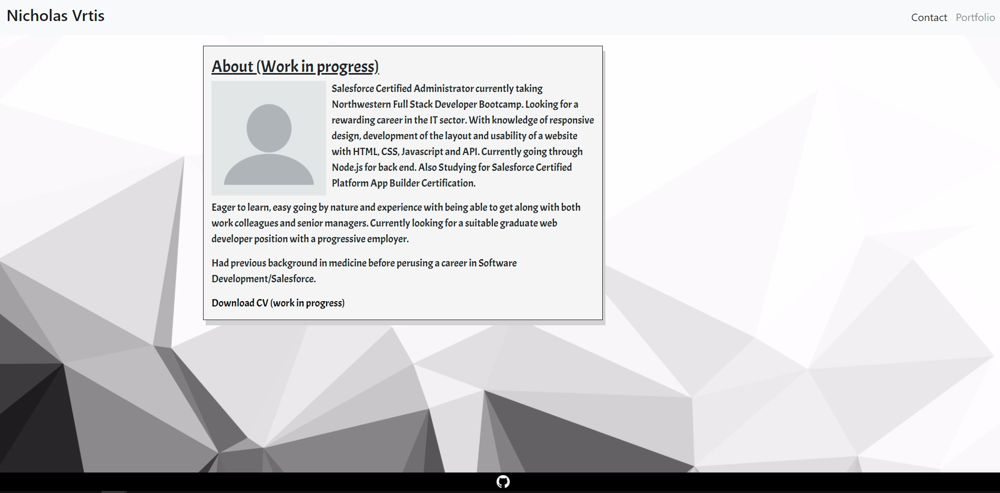
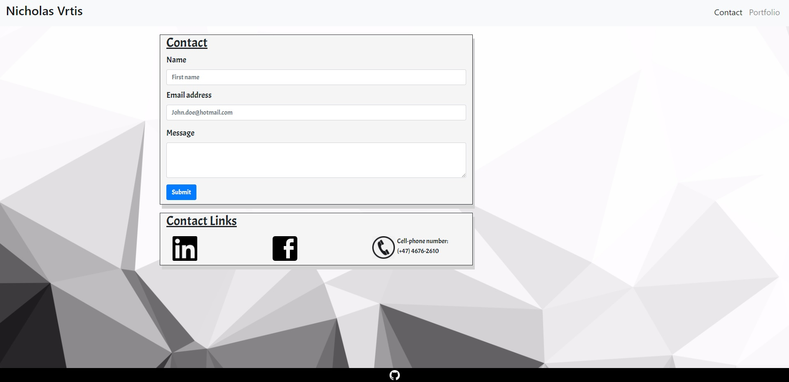
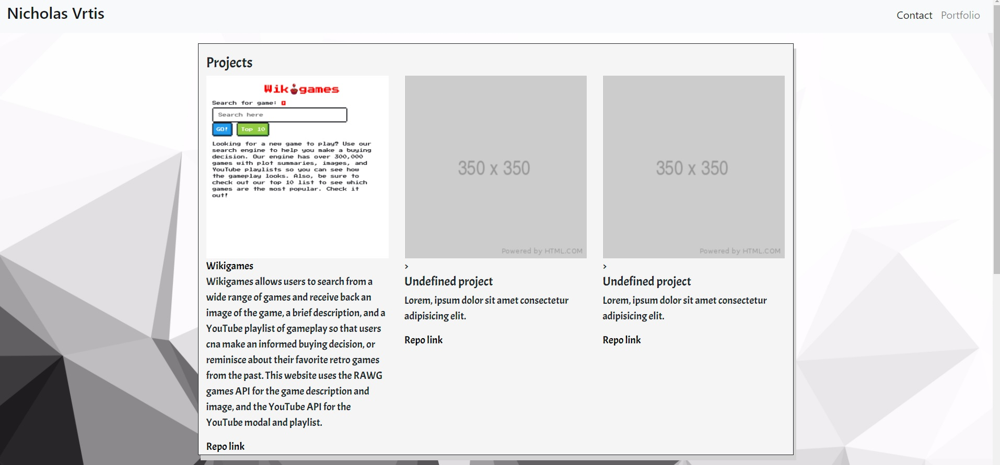

[Link to Webpage](https://nvrtis.github.io/)

# My Portfolio

On the main page you will find a short summary of who i am, what i have done so far in coding.

If you are interessted in learning more about me and my collaborative projects you will find it at this webpage.

This website will be updated when new projects are completed or my skills as a coder has reached a new milestone and i can implement further applications.

## Contact information
Here you find my contact information, The email send button is a work in progress. Further down the screen you will see a link to my Facebook, Linkedin and cellphone number.

## Portfolio
Here you will find a list over the projects and assignments i have had so far. The larger project are pinned first, while the smaller assignments are at the bottom of the page

### Wikigames
Wikigames is a collaborative project with [Zac Jayes](https://github.com/ZJayes), [Mohammad Ali Karimi](https://github.com/karimi65), [Matt Kulling](https://github.com/mokulling) and me.

Wikigames allows users to search from a wide range of games and receive back an image of the game, a brief description, and a YouTube playlist of gameplay so that users can make an informed buying decision, or reminisce about their favorite retro games from the past. This website uses the RAWG games API for the game description and image, and the YouTube API for the YouTube modal and playlist.

[Link to Wikigames](https://mokulling.github.io/wikigames/)

You will also see assignments that i have done earlier, which shows smaller solo project and assignment that i have done.

*This Website framework is using Bootstrap.*

