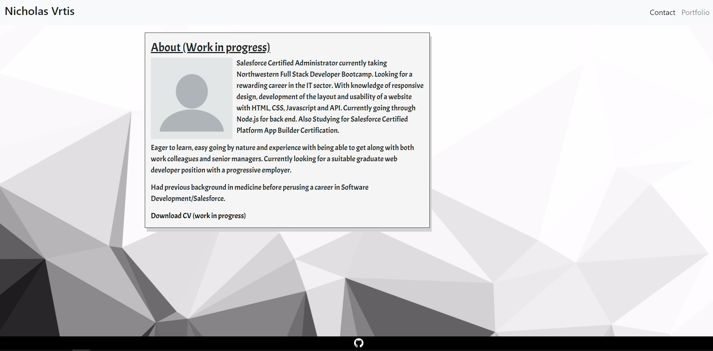
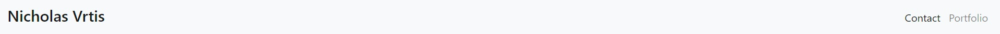
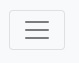
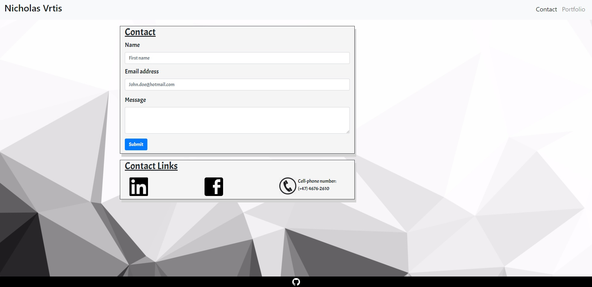
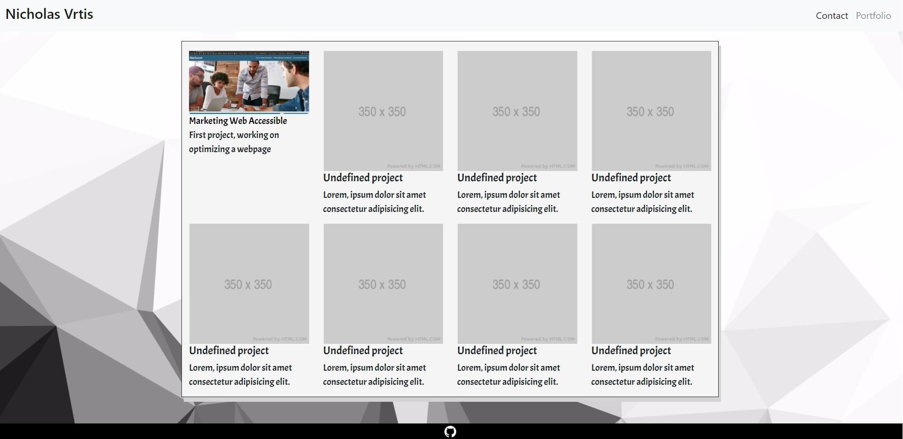

# Responsiv Portfolio
   

[Link to Webpage](https://nvrtis.github.io/)

This project was creating a responsiv website using Bootstrap.
Its is built using the grid style layout, where index and contact pages are using columns 8/12 grids for astethics choice and portfolio is using all columns 12/12 grids.

## Building the sites

The Navbar is copied from Components from bootstrap and removed the search form one of the links included. After renaming the links, i added the class "ml-auto" to {ul class="navbar-nav ml-auto"} on line 24 to move the links to the right side of the nav bar.

There are 3 pages on the site, which are connected through the Nav bar. Index.html linked on the h1 header (Nicholas Vrtis), and; Contact and Portfolio have designated links on the right side. Javascript is only running the hamburger menu on this page.

The Contact and Portfolio link will transform into a hamburger menu when the screen size  992px wide, which makes it optimal when using smaller screens. I have also added hover pseudo classes on all the links on the nav bar.

On the Index.html page, there is only one container with some placeholder image and text. The image is floating on the left side on desktop pc, but with media queries will stop floating on smaller screens, so that the text will appear underneath the image.
The footer is fixed on the bottom to have it out of the way, with some placeholder image for github and inverse filter (filter: invert(1);). With media queries the the container will add a margin on the bottom of the container so that the footer doesnt cover the text on smaller screens.

Contact.html is where we have the forms for sending an email, but for now there is no backend script, so the emails/messages are not sendt anywhere. Also added contact links on the bottom, which will have 50% opacity when hovering over. The phone image is floating on larger screens, but on smaller screens the phone image will have its floating characteristics removed 

Portfolio.html are set up in columns size of 3, so we can have 4 images next to each other. Here i have linked the image and the "headline" to the first project, and created pseudo class so that it show when hovering over the image or text, with opacity or increase in font size and underline. This is where i will upload all projects and link them further on, but for now there is alot of placeholders.

Also i avoided having everything in portfolio in a subcontainer because of the lack of real estate i got from the screen was not optimal.  

## Styling the sites

I have already mentioned the media queries and floating of the images. Other than padding and margins to make everything fit well together in both large and small screens. I have also included a font from google fonts and a background image aswell.
All images also have an Alt pluss class image-float to make them responsive.

<!-- # Unit 02 CSS and Bootstrap Homework: Responsive Portfolio

Responsive design ensures that web applications render well on a variety of devices and window or screen sizes. As a developer, you will likely be asked to create a mobile-first application or add responsive design to an existing application.  -->

<!-- ## Directions

First, you will use the Bootstrap CSS Framework to create a mobile responsive portfolio. How do you deliver this? Here are some guidelines:

* Create the following files files: `index.html`, `portfolio.html` and `contact.html`. -->

<!-- * Using Bootstrap, develop your portfolio site with the following items:

   * A navbar

   * A responsive layout

   * Responsive images -->

<!-- * The Bootstrap portfolio should minimize the use of media queries. -->
<!-- 
* Screenshots are provided as a reference in the `Assets/Images` folder. Your app does not need to be _exactly_ like the images. Use Bootstrap to create a similar, responsive layout. -->

<!-- ### Hints

* Use Bootstrap's grid system (containers, rows, and columns).

* On an `xs` screen, content should take up the entire screen. On `sm` and larger screens, you should have some margins on the left and right sides of the screen. Check out various sites on your mobile device vs. your computer to see examples of these differences. -->

<!-- * Use an HTML validation service to ensure that each page has valid HTML. -->

<!-- ### Minimum Requirements -->

<!-- * Functional, deployed application -->

<!-- * GitHub repository with README describing the project -->

<!-- * Navbar must be consistent on each page. -->

<!-- * Navbar on each page must contain links to Home/About, Contact, and Portfolio pages. -->

<!-- * All links must work. -->

<!-- * Must use semantic html. -->

<!-- * Each page must have valid and correct HTML. (use a validation service) -->

<!-- * Must contain your personalized information. (bio, name, images, links to social media, etc.) -->

<!-- * Must properly utilize Bootstrap components and grid system. -->

<!-- ### Bonus -->

<!-- * Using Bootstrap, make a sticky footer and use sub-rows and sub-columns on your portfolio site (**Hint:** Check out the Bootstrap documentation). -->

<!-- ## Commit Early and Often -->

<!-- One of the most important skills to master as a web developer is version control. Building the habit of committing via Git is important for two reasons: -->

<!-- * Your commit history is a signal to employers that you are actively working on projects and learning new skills. -->

<!-- * Your commit history allows you to revert your codebase in the event that you need to return to a previous state. -->

<!-- Follow these guidelines for committing: -->

<!-- * Make single-purpose commits for related changes to ensure a clean, manageable history. If you are fixing two issues, make two commits. -->

<!-- * Write descriptive, meaningful commit messages so that you and anyone else looking at your repository can easily understand its history. -->

<!-- * Don't commit half-done work, for the sake of your collaborators (and your future self!). -->

<!-- * Test your application before you commit to ensure functionality at every step in the development process. -->

<!-- We would like you to have well over 200 commits by graduation, so commit early and often! -->

<!-- ## Submission on BCS

You are required to submit the following:

* The URLs of the deployed applications

* The URLs of the GitHub repositories

<!-- - - - -->

<!-- © 2019 Trilogy Education Services, a 2U, Inc. brand. All Rights Reserved. -->
